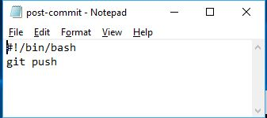
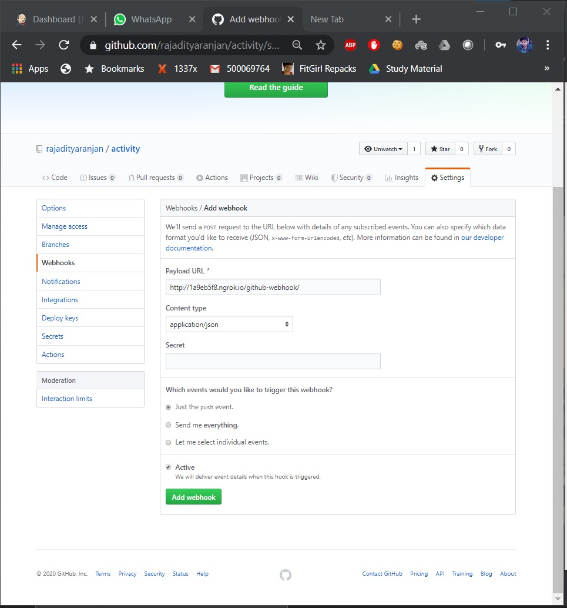
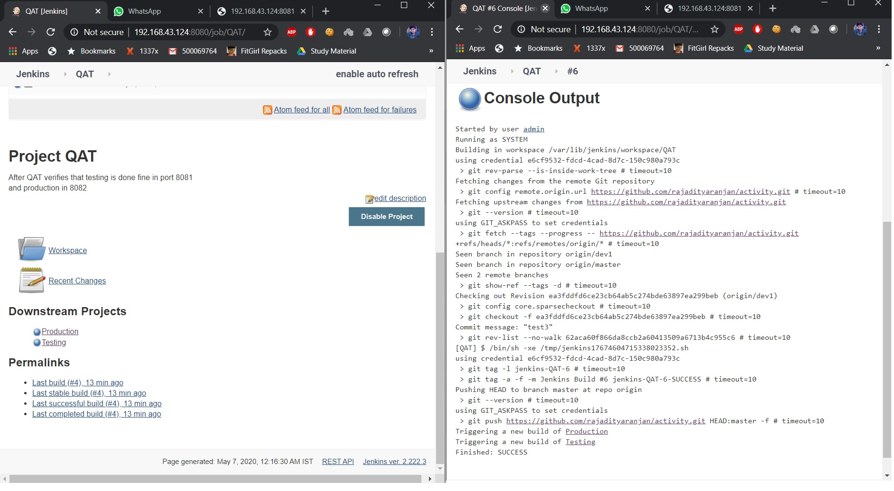
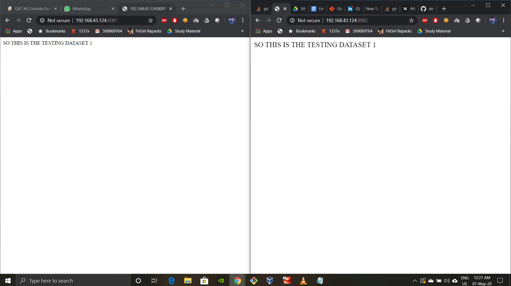
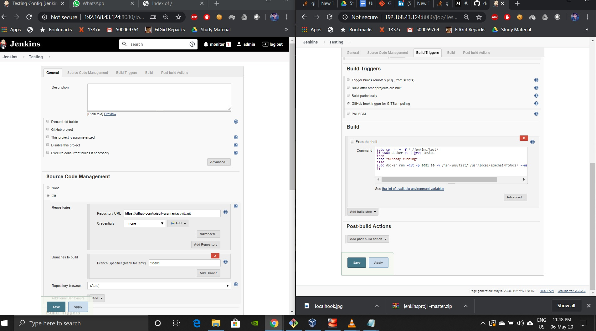
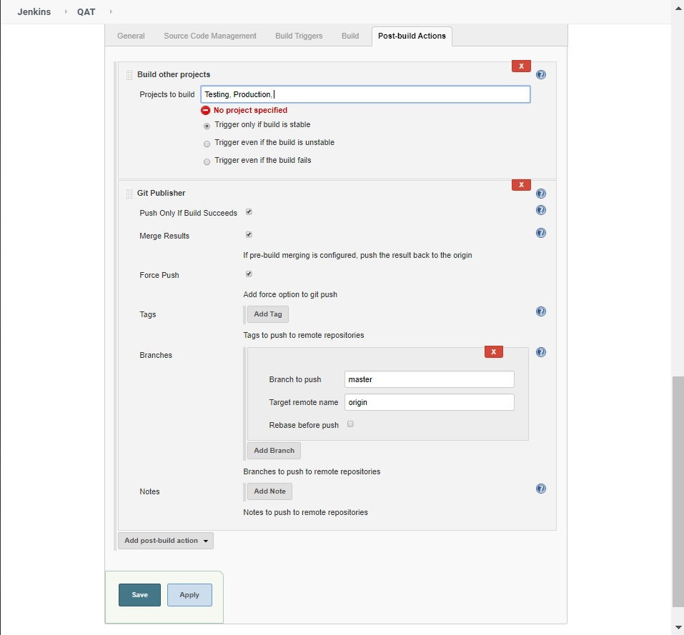
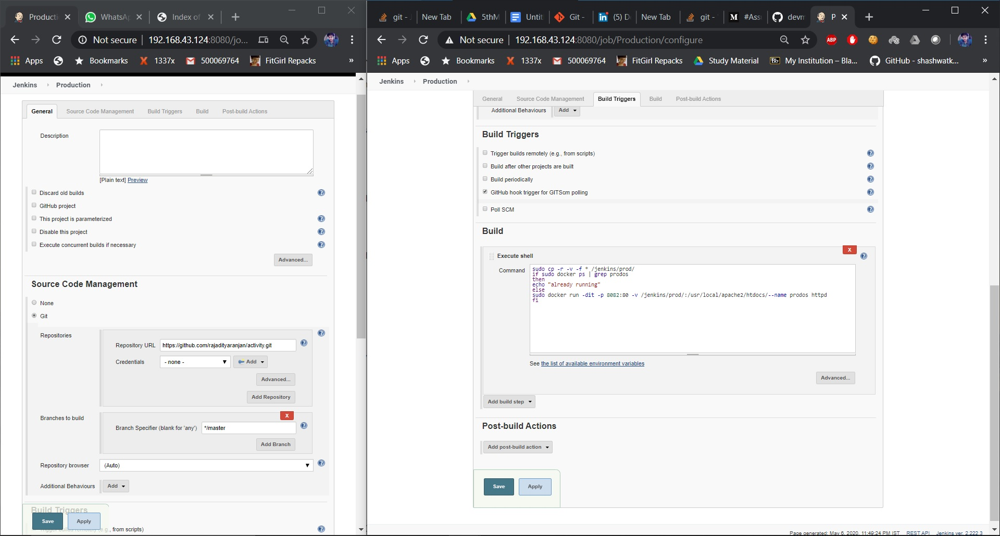

# Objective :

Setting up an infrastructure where there are three environments :

1. Production
2. Testing
3. Quality Assurance Team

This process start with production team and developer team had created two branches(developer**(dev1)** and production**(master)**) in the local git environment. Both of these branches(HEAD is at the same commit ID) are pushed into the github repository over the internet.
Now comes the role of the developer who is working in local git on an update so he/she as soon as commits, first the update is run on a docker container utilizing few commands and tricks in a localhost, after it loaded successfully, a QAT member checks and verifies if the updates are correct and which satisfies all criterias for prodcution and approves it. 
As soon as the QAT approves, both the branches of development and production are merged succesfully.

## Requirements :

1. Docker
   - Image: httpd
	`docker pull httpd`
	
   - Container:	To create a persistent storage we link the apache http folder to the testing environment in the local host which was pulled from github as soon as developer pushes it.
	`docker run -dit -p 8081:80 -v /jenkins/test/:/usr/local/apache2/htdocs/ --name testos httpd`
2. Jenkins
   - Github Plugin
3. ngrok
   To run a particular port-
	`./ngrok http **port no**`

## Process :

### Developer side :

1. Created a hook for post-commit in local git to automate pushing the code into github repository each time developer commits

   

   

2. Added The webhooks to the Jenkins Github Webhooks in the settings :=> `ip/github-webhook/`

### Operations Side:

1. My jobs Production and Testing will get their code from the github (from their respective branches => master:production, dev1:testing)
2. Both the containers have diferent ports done with the help of PAT in networking part of docker to avoid pre-merging of progress and proper isolation is achieved
3. QAT continously checks for changes in testing environement, and decides whether to approve it or not.
4. On approval QAT manually builds the job called QAT which helps to merge both the branches.

**Note**- Here QAT is the upstream job of Production and Testing , so on successful approval following things will happen:
   1. dev1 and master branch will be merged
   2. Production and Testing will be build as it pushes both the updates on github too.

- ngrok will give public IP with the method called tunneling so that github webhook will work. Its a free version so after some time it expires while we cannot give proper DNS to it.

## Screenshots :

## Actual work happening in this project.

1. Production was behind Testing so only the url which points to port 8081 is ahead of the port 8082, after the commit done by the developer testing is done which is to be approved by the QAT(Quality Assurance Team) department. Until QAT approves production can not be updated.

2. QAT team tests and approves(this was built manually as still I don't know about the testing integration part). This can be inferred by the successful build by Project QAT in jenkins.

3. After the verification is done the testing environment data is succesfully merged with the production environment. After this both the environment are equal.

## Steps involved in the configuration of jenkins job creations-

## 1. Testing:

* As soon as the developer pushes the code, github webhook will be activated and it will contact jenkins which will pull/fetch the updated code, and move it to the created volume.

* I provided the conditional statement to check wether the docker container is already running, if not create it mount the volume and expose it's port 80 to base os port 8081
`docker run -dit -p 8081:80 -v /jenkins/test/:/usr/local/apache2/htdocs/ --name testos httpd`

**Note**- We created a directory inside local host /jenkins/test/

QA team will check the testing environment at this port address.

## 2. Quality Assurance Team(QAT) :

* I provided the github repository link along with credentials as on approval there should be a merge between the master and dev branch, and also the code should be pushed to github.

* Details is provided to the additional behaviour so that merging could be done.

* Post Build Action details provided, so that push after the merge can be done

* After the push is being done. This job will call the jobs Production and Testing so that the code can be updated.

## 3. Production:

* Whenever the QAT approves the dev1 code is merged with the master and is pushed into github  through webhook which will be activated and it will contact jenkins, then jenkins will pull the updated code, and move it to the created volume.

* I provided the conditional statement to check wether the docker conatiner is already running, if not create it mount the volume and expose it's port 80 to base os port 8082.

`docker run -dit -p 8082:80 -v /jenkins/prod/:/usr/local/apache2/htdocs/ --name prodos httpd`

**Note**- We created a directory inside local host /jenkins/prod/

